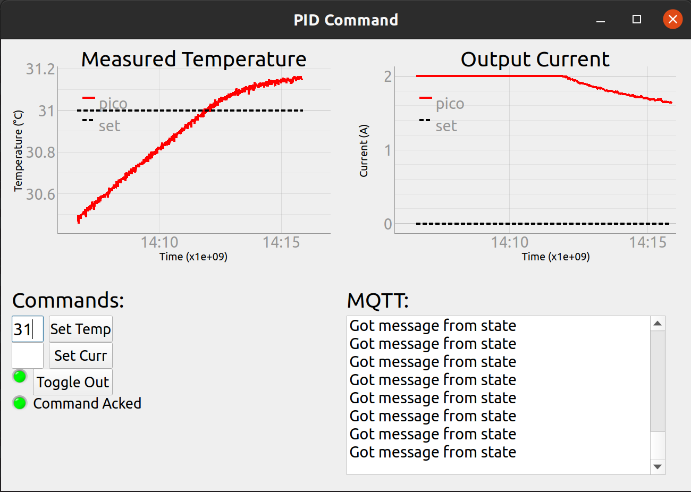

# pid-controller-pico

## Setup

### Command

To install prerequisites:

```sh 
sudo pip3 -H install pyqt5 pyqtgraph
```

### Mosquitto (MQTT Broker)

Install mosquitto:

` sudo apt install mosquitto `

To run mosquitto in verbose mode:

` mosquitto -c mosquitto.conf -v `

To ensure it runs on startup (and run it now):

` sudo systemctl enable mosquitto && sudo systemctl start mosquitto `

You also have to copy the `mosquitto.conf`:

` sudo cp mosquitto.conf /etc/mosquitto/mosquitto.conf `

### RPi Pico

To setup the pico fresh, hold down the bootsel button and plug it into the computer. Download the latest adafruit circuitpython uf2 and the latest circuitpython library bundle. (Make sure the versions match, a new major revision is coming out soon, I used the old one, version 6.x.x). Then, drag and drop the circuitpython uf2 to the pico, it'll then remount itself. Now the pico will show up as a drive. Drag and drop the following files to the `lib` folder:

Folders:
* `adafruit_bus_device`
* `adafruit_minimqtt`
* `adafruit_wiznet5k`
* `adafruit_ads1x15`

Files:
* `adafruit_requests.mpy`
* `adafruit_mcp4725.mpy`

As for wiring, the ethernet is wired as follows (diagram and other documentationshows the ethernet interface as WIZ820io, but the prototype that Alex constructed in Spring 2021 used WIZ850io --- JDDM).


The i2c bus is wired: pin 26 (GP20) - SDA, pin 27 (GP21) - SCL, and of course, ground to ground and 3v3 to 3v3.

See also: [Schematic](docs/schematic.pdf) and [PCB Layout](docs/pcb.pdf).

In order to program the pico, all you have to do is copy the code.py to the pico, and it will then run that code on boot. One can also install the Thonny editor or the Mu editor. To one can then set Thonny to "Micropython" and point it at the correct serial port (com4 for me) and then you get a REPL running on the pico!

## Settings (defaultSettings dictionary)

The meaning of each entry in the defaultSettings dicitonary is as follows:
* `'setCurrent':0` (Amps) the amount of current to output
* `'setTemp':25` (deg C) the current set temperature to hold
* `'Kc': 6.0787` (W/deg C) PID proportional gain
* `'Ti':330` (sec) PID integration time
* `'Td':0` (sec) PID derivative time (zero gives only a PI control)
* `'I_max':4` (W^2) Maximum value of the I term in PID (best left at max power, 0 -> disabled) 
* `'loadResist':1` (ohm) resistance of the load resistor
* `'maxTemp':150` (deg C) max temperature of the load
* `'maxCurr':2.0` (Amps) max current the load can withstand
* `'maxResVolt':5` (Volt) voltage indicating max resistance
* `'maxRes':13` (kohms) max resistance at max voltage
* `'maxSuppCurrVolt':5` (Volt) the voltage signal that will cause max current from the supply
* `'maxSuppCurr':2` (Amps) max current given by max voltage
* `'thermBeta':3380` (kelvin) thermistor beta
* `'thermR25':10` (kohm) resistance of thermistor at 25 degC
* `'outputToggle':0` are we outputting?
* `'filterHz':1` (Hz) block freqencies higher than this
* `'period':0.016666667` (sec) how often to update PID
* `'constCurr':False` (bool) are we running constant current or PID temperature?
* `'maxErrorLen':100` (int) how many terms to keep around for error
* `'freqAnalysis':False` (bool) outputs current following a cosine wave, only really used for a specific sort of PID tuning
* `'reportMode':'mean'` (one of 'mean', 'latest') report the temperature and current as either the mean of all values since the last or just the latest values
* `'user':'pico'` MQTT username for the PID controller
* `'password':'password'` MQTT password for the PID controller
* `'serverIP':"192.168.0.100"` IP address of the MQTT broker
* `'mqttDelay':5e8` (nsec) how often to poll for mqtt messages and send the current state
* `'mqttReconn":300e8` (nsec) how often to attempt reconnecting to MQTT (is slow, don't attempt often)
* `'lcdRefresh':2.5e8` (nsec) how often to refresh the lcd screen


## User Interface:


## Control UI:



This is the remote command window, featuring set temperature command, set current command, and a toggle output command. For the indicator next to toggle out, red means no current being outputted, and green means current being outputted. The "Command Acked" indicator shows whether or not the pico has recieved and replied to whatever the latest command was, red meaning no, green meaning yes. 

In the bottom right is a text window which updates when acks and messages are recieved, and it will also display errors from trying to type text into the set temp and set curr boxes. 

Finally, in the top is two graphs, they can be panned and zoomed at will, and update with the latest and greatest data from the pico. 

The ui has some configurable parameters, which can be found near the top of [server.py](server/server.py), which include what username the server is, what username the pico is, a password for the mqtt broker, and the IP of the mqtt broker. The broker and command need not be run on the same device, but they can be. 


## Notes:

* printing (which prints to serial) puts a lot of delay (and sometimes doesnt work at all)
* you might have to reconfigure the IP and gatway of the pico depending on network architecture. Run `ipconfig` on windows or `ip addr` on linux to find the relevant details
* the MQTT client keep\_alive is (for some really dumb reason) used as the default pingresp timeout, which means you either flood the broker with ping requests or you wait forever (with no PID processing in the meantime) if the broker ever goes down. I thought 5 seconds would be a fair tradeoff. Even worse: keep\_alive is used as the default recieving timeout, so we can't set it extremely low either. I thought it would be better not to edit and recompile the adafruit library to remedy this, but if desired it would be quite easy.
* for whatever reason, *sometimes* the ADC reads anything greater than 4.1V as exactly 4.1V, I think this is a referencing issue, but it doesn't always come up. This corresponds to a current of 1.64A. 
